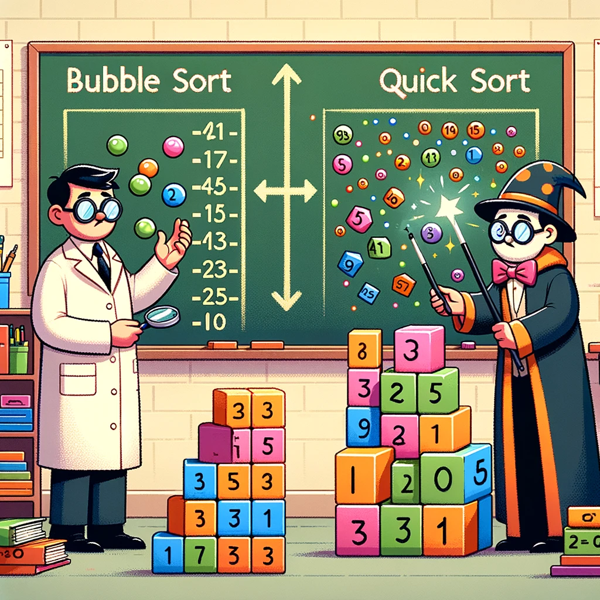

# サンプルドキュメント

<div class="author-info">
名前<br />
会社、所属やSNSなど
</div>

## バブルソートとクイックソート

Swift での次のソートアルゴリズムの実装例と説明をします。[^ChatGPT]

[^ChatGPT]: ChatGPT で書きました

- バブルソート
- クイックソート

{width=300}

## バブルソート

バブルソートは非常にシンプルなソートアルゴリズムで、隣接する要素を比較して、不適切な順序の場合は交換することを繰り返します。このアルゴリズムは効率がよくないため、データ量が少ない場合に適しています。

```swift
func bubbleSort(_ array: inout [Int]) {
    let n = array.count
    for i in 0..<n {
        for j in 1..<n-i {
            if array[j-1] > array[j] {
                array.swapAt(j-1, j)
            }
        }
    }
}
```

## クイックソート

クイックソートは分割統治法を用いた高速なソートアルゴリズムです。ピボットと呼ばれる要素を選び、ピボットより小さい要素は左側に、大きい要素は右側に配置します。その後、左右のサブ配列に対して同じ処理を再帰的に適用します。

```swift
func quickSort(_ array: inout [Int], low: Int, high: Int) {
    if low < high {
        let pivotIndex = partition(&array, low: low, high: high)
        quickSort(&array, low: low, high: pivotIndex - 1)
        quickSort(&array, low: pivotIndex + 1, high: high)
    }
}

func partition(_ array: inout [Int], low: Int, high: Int) -> Int {
    let pivot = array[high]
    var i = low
    for j in low..<high {
        if array[j] <= pivot {
            array.swapAt(i, j)
            i += 1
        }
    }
    array.swapAt(i, high)
    return i
}
```

## 使用方法

これらの関数 `bubbleSort` と `quickSort` を実際に使用するには、次のように配列を引数として渡して呼び出します。

```swift
// バブルソート
var numbers = [8, 4, 3, 7, 6, 5, 2, 1]
bubbleSort(&numbers)
print("Bubble Sorted: \(numbers)")

// クイックソート
numbers = [8, 4, 3, 7, 6, 5, 2, 1]
quickSort(&numbers, low: 0, high: numbers.count - 1)
print("Quick Sorted: \(numbers)")
```

このように、Swift でバブルソートとクイックソートを実装できます。バブルソートはコードがシンプルで理解しやすい一方で、クイックソートはより高速に多量のデータをソートできます。

||バブルソート|クイックソート|
|:-:|:-:|:-:|
|実装|簡単|ムズイ|
|速度|遅い|早い|

## でたらめ文章ジェネレーター [^BullshitGenerator-Japanese]

<!-- textlint-disable -->

こんな事実は私本人に対して深刻な意味を持って、この世界にとってもある程度有意義なことだと信じています。 昔ブライアン・アダムスはこう言いました、「貴方の周りを変えようとしてもほとんど意味がない。まず最初に、自分の信念を変えなさい。そうすれば、貴方の周りのあらゆることがそれに応じて、変わる。」思い返せば。 昔カーリル・ギブランは不意にこう言いました、「お互いに手をつなぐ時にも間をあけよう。」こういう思考を持って、我々はこの問題をより慎重に考え直さねばならない： 消費税100%増税は一体どんな存在であるかをずばり考えることです。 考え直してみれば、。

誰でも時々こんな問題に遭遇するのでしょう。 こんな問題に対面している時、 しかし、こうした件は全部が重要ではない。もっと重要なのは、 昔マーガレット・ロセッティはこう言いました、「こういう無批判な愛は嬉しかった。それなら、こちらも惜しみなく愛してやれたから。」短いながら、この言葉は私に様々な考えを持たせます。 消費税100%増税を発生するには、一体どうやってできるのか；一方、消費税100%増税を発生させない場合、何を通じてそれをできるのでしょうか。 我々はとても言い難い事実を面せざるを得ない、それがでしたら、 昔スタール夫人はこう言いました、「すべてを納得すれば、心はきわめて寛大になる。」こうした中、私の疑問が解けました。私本人もじっくり考えながら、夜となく昼となく消費税100%増税のことを考えています。 昔ジョシュア・リーブマンはこう言いました、「いつまで一緒にいられるか分からないということをしっかり心にとめてお互いを大切にしよう。」こういう思考を持って、我々はこの問題をより慎重に考え直さねばならない： 個人的に言うなら、消費税100%増税は私にとって非常に重要だと言わなければならないです。 とりあえす、 これらの疑問を持って、我々は消費税100%増税を念入りに考えましょう。

<!-- textlint-enable -->

[^BullshitGenerator-Japanese]: https://garily.github.io/BullshitGenerator-Japanese/
