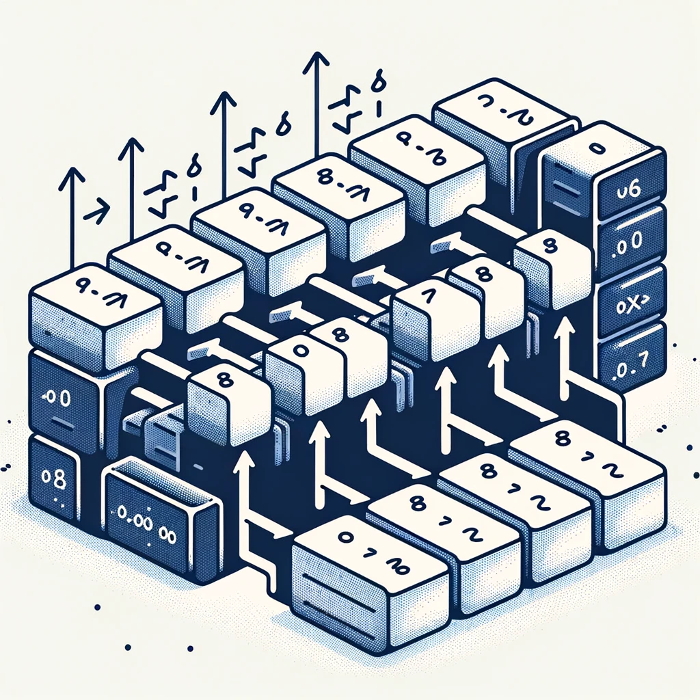

# バブルソートの説明

<div class="author-info">
サンプルたろう（株式会社????）<BR />
𝕏: @????<BR />
Bluesky: @????.bsky.social
</div>

バブルソートは、隣接する要素を比較して並べ替える簡単なソートアルゴリズムです。初学者にも分かりやすいように、Swift のコードと一緒にイラストと表を使って説明します。[^ChatGPT]

[^ChatGPT]: この文章と画像は ChatGPT で書きました

## バブルソートのイラスト

次のイラストは、バブルソートの過程を示しています。

{width=300}

1. **初期状態**: ソートされていない配列が並んでいる
2. **比較と交換**: 隣接する要素を比較し、必要に応じて交換する
3. **最終状態**: 配列がソートされた状態になる

## Swiftでのバブルソートのコード

```swift
func bubbleSort(_ array: inout [Int]) {
    let n = array.count
    for i in 0..<n {
        for j in 0..<n-i-1 {
            if array[j] > array[j+1] {
                let temp = array[j]
                array[j] = array[j+1]
                array[j+1] = temp
            }
        }
    }
}

var numbers = [64, 34, 25, 12, 22, 11, 90]
bubbleSort(&numbers)
print("Sorted array: \(numbers)")
```

### コードの説明

1. **関数宣言**: `bubbleSort`関数は、整数の配列を受け取り、インデックスでアクセスして要素を並べ替える
2. **外側のループ**: 配列全体を繰り返し処理する
3. **内側のループ**: 隣接する要素を比較し、順番が逆であれば交換する
4. **交換処理**: 要素を一時変数に保存し、隣接する要素と入れ替る

## バブルソートの過程を示す表

| イテレーション | 配列の状態              | 比較された要素         | 交換された要素 |
|--------------|--------------------|-------------------|-------------|
| 初期状態         | [64, 34, 25, 12, 22, 11, 90] | -                 | -           |
| 1            | [34, 25, 12, 22, 11, 64, 90] | 64と34, 34と25, ... | 64と34       |
| 2            | [25, 12, 22, 11, 34, 64, 90] | 34と25, 25と12, ... | 34と25       |
| 3            | [12, 22, 11, 25, 34, 64, 90] | 25と12, 22と11, ... | 25と12       |
| ...          | ...                | ...               | ...         |
| 最終状態         | [11, 12, 22, 25, 34, 64, 90] | -                 | -           |

この表は、各イテレーションごとに配列の状態がどのように変化するかを示しています。各ステップで、隣接する要素を比較し、必要に応じて交換することで、配列が徐々にソートされていきます。

バブルソートは、シンプルなアルゴリズムですが、大規模なデータセットには効率的ではないため、学習目的や小規模なデータセットでの使用に適しています。
